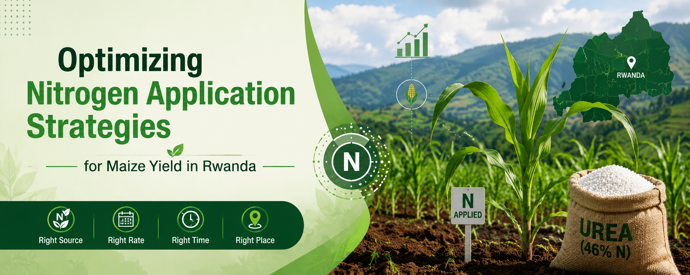

<h1 align = "center"> 
Optimizing Nitrogen Application Strategies <br> 
for Maize Yield in Rwanda
</h1>

<p align = "center">

</p>

## Analysis Charter:

Optimizing Nitrogen Application Strategies for Maize Yield in Rwanda: A Hierarchical Modelling and Geopspatial Analytics Approach.

## Overview

This project investigates fertilizer application strategies and their impact on maize yield across different agroecological environments in Rwanda.

---

## Repository Structure

```text
|   
├── dashboard/
|
├── data/
|    ├── external/
|    ├── interim/
|    ├── processed/ 
|    └── raw/
|         ├── Codebook.csv
|         ├── Field_Level.csv
|         ├── Plot_Level.csv
|         └── Soil_PL.csv
|
├── notebooks/
|    └── 01_data_audit.ipynb
|
├── outputs/
|    ├── figures/
|    ├── maps/
|    └── tables/
├── report/
|    ├── figures/
|    └── references/
├── scripts/
├── tests/
├── .gitignore
├── environment.yml
├── LICENSE
├── README.md
├── requirements.txt

```
---

## Project Background

OAF Inc., an agricultural organization based in East Africa, conducted multi-season maize field trials across Rwanda to evaluate the impact of varying urea fertilizer application rates and timing strategies on maize productivity. Data were collected at multiple levels including field, plot, and soil levels across several agroecological regions and mega-environments.
Each field was divided into multiple experimental plots receiving distinct urea rate and timing combinations. Additional management and environmental variables such as planting practices, soil properties, and geographic information were also collected.
The purpose of this analysis is to convert experimental observations into actionable agronomic recommendations and predictive insights that can support evidence-based fertilizer management decisions for farmers and agricultural extension teams.

## Business Problem

Agricultural productivity among smallholder farmers varies substantially across geographic environments due to differences in soil conditions, management practices, and environmental characteristics. Fertilizer recommendations that apply a uniform strategy across all environments may lead to:
1.  inefficient fertilizer utilization
2.	unnecessary input costs
3.	reduced crop yields
4.	nutrient losses
5.	inconsistent farmer outcomes
OAF Inc., therefore, requires a data-driven framework capable of:
 -	identifying fertilizer application strategies that maximize maize yield under varying environmental conditions
 -	understanding major drivers influencing yield variability
 -	predicting yield outcomes under different conditions
 -	supporting location-specific fertilizer recommendations
 -	improving future decision making for field implementation

## Project Goal

Develop an analytical framework that can identify optimal strategies to apply urea fertilizer across Rwanda’s maize-growing environments, and also generate a predictive and decision-support tool for future agronomic recommendations. 

## Analytical objectives

Objective 1: Evaluate urea rate and timing performance
Determine how different urea application rate and timing combinations affect maize yield across distinct mega-environments.

### Sub-objectives:

1.	Estimate effects across environments 
2.	Identify the highest-performing treatment strategy within each mega-environment
3.	Determine whether observed differences are statistically significant 
4.	Assess whether the effectiveness of treatment changes according to environmental context

## Expected output:

-	Treatment comparison tables
-	Statistical significance testing
-	Treatment x environment interaction analysis
-	Confidence estimates

## Objective 2: Identify drivers of maize yield

Determine environmental, soil, geographic and management factors associated with maize yield variability.

### Sub-objectives:

1.	Evaluate effects of:
 -	Soil characteristics
 -	Fertilizer inputs
 -	Seed rates
 -	Elevation
 -	Weather variables
 -	Management practices
2.	Quantify variable importance
3.	Identify potentially actionable drivers for intervention 

### Expected output:

-	feature importance rankings
-	explanatory visualizations
-	SHAP analysis
-	driver interpretation

## Objective 3: Develop Yield Prediction Model

Build predictive models capable of estimating maize yield under varying agronomic conditions.

### Sub-objectives:

1.	Compare baseline and machine learning approaches
2.	Evaluate model performance
3.	Assess generalizability
4.	Quantify uncertainty

## Expected output:
-	Model comparison table
-	RMSE
-	MAE
-	R²
-	Cross-validation performance

## Objective 4: Develop Decision Support Framework

Develop a recommendation framework capable of supporting fertilizer strategy selection under different environmental conditions.

### Sub-objectives:

1.	Estimate expected yield under each treatment option
2.	Recommend treatment strategies that maximize expected performance
3.	Quantify expected gain and uncertainty 

## Expected output:

-	recommendation logic
-	decision rules
-	scenario simulations

## Objective 5: Conduct Spatial Analysis

Assess geographic patterns and spatial variability of trial outcomes.

### Sub-objectives:

1.	Visualize trial field distribution
2.	Explore spatial clustering of yield outcomes
3.	Map environmental variability
4.	Visualize recommended treatment regions

## Expected output:

-	Field maps
-	Yield heatmaps
-	Treatment recommendation maps

## Research Questions
-	RQ1: Which urea application strategy generates the highest maize yield within each mega-environment?
-	RQ2: Do treatment effects differ significantly across environments?
-	RQ3: Which environmental and management factors most strongly influence maize yield?
-	RQ4: Can maize yield be reliably predicted using observed environmental and management variables?
-	RQ5: Can location-specific fertilizer recommendations improve decision making?

## Hypotheses

### Treatment Performance

H0₁: There is no significant difference in maize yield among urea application strategies.
H1₁: At least one urea application strategy produces significantly different maize yields.

### Environment-Treatment Interaction

H0₂: Treatment effectiveness does not vary across mega-environments.
H1₂: Treatment effectiveness varies significantly across mega-environments.

### Yield Drivers

H0₃: Environmental and management variables have no significant relationship with maize yield.
H1₃: Environmental and management variables significantly influence maize yield.

### Predictive Modeling

H0₄: Observed variables cannot explain meaningful variability in maize yield.
H1₄: Observed variables explain meaningful variability in maize yield and can support predictive modeling.

### Spatial Effects

H0₅: Maize yield exhibits no meaningful spatial pattern across trial locations.
H1₅: Maize yield demonstrates spatial variability across locations.

### Assumptions

This analysis is conducted under the following assumptions:
-	Experimental observations are accurately recorded.
-	Treatment allocation was appropriately randomized.
-	External datasets (SoilGrids, CHIRPS) adequately represent field conditions.
-	Missing observations are either random or can be appropriately addressed.
-	Trial observations across seasons reasonably represent broader agronomic patterns.
-	Spatial and temporal uncertainty from external data sources will not substantially alter major conclusions.

### Expected Business Value

This analysis is expected to provide:
-	Evidence-based fertilizer recommendations
-	Improved understanding of drivers of productivity
-	Scalable decision-support tools
-	More efficient resource allocation
-	Improved farmer outcomes
-	Stronger future trial design recommendations

## Methods

- Mixed-effects models
- Random Forest
- Gradient Boosting
- SHAP analysis
- Geospatial mapping

---

## Status

Project currently under development.