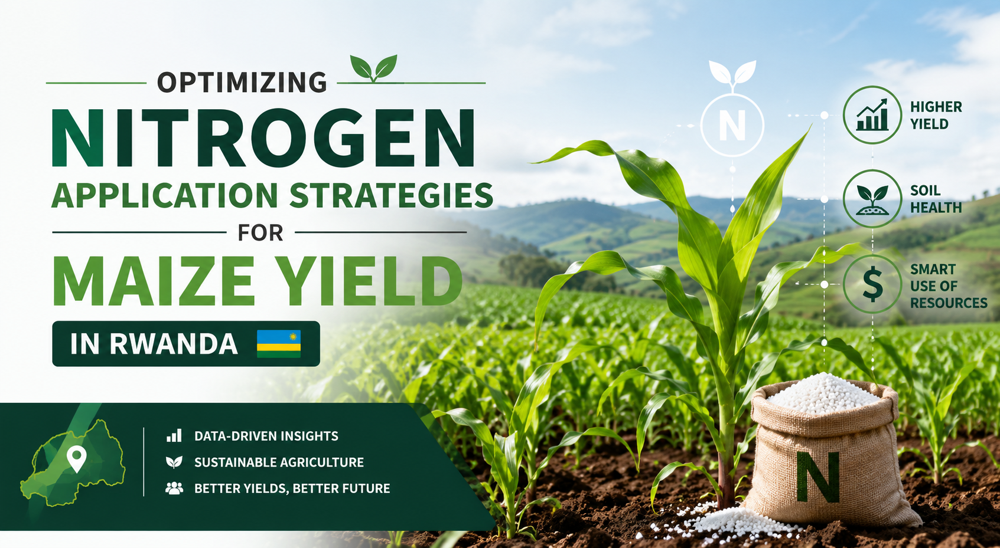

---

<h1 align = "center"> 
Rwanda Maize Yield Optimization: Urea Trial
</h1>

<p align = "center">

</p>

---

<h4 align = "center"> 
Optimizing Nitrogen Application Strategies for Maize Yield in Rwanda
</h4> 

# Project Understanding and Analytical Framework

## Repository Structure

```
rwanda-maize-urea-analysis/
│
├── 01_Data/
│   ├── raw/
│   ├── external/
│   └── processed/
│
├── 02_Notebooks/
│   ├── 01_data_audit.ipynb
│   ├── 02_data_preparation.ipynb
│   ├── 03_eda.ipynb
│   ├── 04_treatment_analysis.ipynb
│   ├── 05_yield_drivers.ipynb
│   ├── 06_yield_prediction.ipynb
│   └── 07_spatial_analysis.ipynb
│
├── 03_Scripts/
│
├── 04_Outputs/
│   ├── figures/
│   ├── tables/
│   └── models/
│
├── 05_Report/
│   └── Rwanda_Maize_Urea_Trial_Report.pdf
│
├── 06_Dashboard/
│   ├── images/
│   └── screenshots
│
└── README.md
```


# I. Background and Research Context

**Evergreen Institute** is a non-profit research organization working with farmers across Africa to improve agricultural productivity and, ultimately, farmer livelihoods.

As part of this objective, Evergreen conducted a field research trial in Rwanda to investigate how different **Urea fertilizer rates and application timings** affect maize grain yield.

The trial was conducted across **three agricultural seasons** and multiple **mega-environments (MEs)** in Rwanda. The experiment was implemented at the field level, with each trial field divided into four plots. Each plot received one of four Urea rate/timing combinations.

The primary outcome of interest is **maize grain yield (`yield_tha`)**.

For this project, analysis, is tailored to to move beyond simply determining which treatment has the highest average yield. We aim to establish:

1. whether treatment differences are statistically supported;
2. whether treatment performance changes across mega-environments and seasons;
3. which environmental and agronomic factors help explain yield variation;
4. whether additional external data, particularly soil and rainfall information, can improve the analysis;
5. whether yield can be predicted with reasonable accuracy; and
6. how the evidence can be translated into practical recommendations for extension teams.

---

# II. Overall Analytical Question

The overarching question for this project is:

> **How does Urea fertilizer rate and application timing affect maize yield across different production environments in Rwanda?** and **under what environmental and agronomic conditions should each treatment be recommended?**

For this project, we'll separate this into four analytical questions:

### Question 1 — Treatment performance

* Which Urea rate/timing combination produces the highest maize yield within each mega-environment, and 
* Are observed differences statistically significant?

### Question 2 — Yield drivers and extension recommendations

* What environmental, agronomic, management, and treatment-related factors are associated with maize yield, and 
* How can this evidence be translated into location-specific fertilizer recommendations?

### Question 3 — Yield prediction

* Can maize yield be predicted using information available before or during the growing season, and 
* How accurately can the model predict yield?

### Question 4 — Spatial distribution

* Where were the trial fields located, and 
* How were trials distributed across Rwanda's mega-environments and seasons?

---

# III. Experimental Structure

Understanding the experimental structure is critical because the data are hierarchical.

The hierarchy can be represented as:

Mega-environment

```
→ Agro-ecological zone
→ District
→ Cell/site
→ Field
→ Plot
```

Each field was divided into four plots.

Each plot received one of four Urea treatments:

| Treatment |  Urea rate | Application timing | Total Urea |
| --------- | ---------: | ------------------ | ---------: |
| A         | 0.5 kg/Are | V6                 |   50 kg/ha |
| B         |   1 kg/Are | Planting + V6      |  100 kg/ha |
| C         |   1 kg/Are | V6 + V10           |  100 kg/ha |
| D         |   1 kg/Are | V6                 |  100 kg/ha |

The primary outcome is:

**Grain yield (`yield_tha`)**

This experimental structure means that the analysis must recognize that plots from the same field are not necessarily independent observations.

The field is therefore being considered when designing the statistical analysis.

---

# IV. What Each Dataset Tells Us

## i. Field-Level Dataset

The field-level dataset describes the environment in which the trial was conducted.

It provides information about:

* geographic location;
* mega-environment;
* agro-ecological zone;
* district;
* cell;
* elevation;
* landscape position;
* slope position;
* slope;
* soil characteristics;
* field characteristics;
* farmer/field characteristics.

These variables are primarily helpful for answering:

> **Where was the trial conducted**, and 
> **what environmental conditions characterized each trial field?**

The field-level data is therefore particularly important for:

* understanding heterogeneity between fields;
* explaining differences in yield;
* identifying environmental conditions associated with treatment response;
* spatial analysis;
* building predictive models;
* developing extension recommendations.

---

## ii. Plot-Level Dataset

The plot-level dataset contains the actual experimental treatment and agronomic information.

It provides information about:

* Urea treatment;
* Urea application rate;
* Urea application timing;
* DAP application;
* compost;
* seed variety;
* planting;
* germination;
* flowering/silking;
* harvest;
* crop management;
* grain yield.

This is the **core experimental dataset**.

It primarily allows us to investigate:

> **What happened to maize yield under each treatment?**

The plot-level data, therefore, remains central to:

* treatment comparisons;
* treatment × environment analysis;
* treatment × season analysis;
* yield-driver analysis;
* predictive modelling.

---

## iii. Soil Dataset

The soil dataset provides soil information at the plot level.

Available data at start of project:

* `pH`

Missing data at start of project:

* `tot_N`
* `org_C`
* `sand`

The missing variables are to be supplemented using an external open-source soil database such as **ISRIC SoilGrids**.

However, external soil data must not simply be treated as if they are field measurements.

Through the project we distinguish between:

**Observed soil measurements**

and

**Externally sourced spatial estimates.**

We also assess whether the spatial resolution, soil depth, coordinate accuracy, and measurement definitions are appropriate for the trial.

The purpose of adding these variables is to investigate whether differences in soil characteristics help explain:

* baseline yield differences;
* treatment response;
* differences between fields;
* differences between mega-environments.

---

## iv. Weather Data

The supplied datasets do not contain rainfall information at start of project.

Rainfall is potentially important because maize yield is strongly influenced by water availability during crop development.

We therefore obtained rainfall data from **CHIRPS**, an open rainfall dataset.

For each plot/field, we derived:

`rain_plant_silking`

representing cumulative rainfall between the planting date and silking date.

This variable is critical for answering:

> **To what extent do rainfall conditions during the crop's early-to-reproductive development period explain differences in maize yield and treatment performance?**

However, this project refrains from automatically interpreting rainfall as a causal factor simply because it is statistically associated with yield. It distinguishes between association, prediction, and causal interpretation.

---

# V. Data Integration Objective

The final analytical dataset combined the different information sources at the appropriate grain.

Conceptually:

```
    Field data
        +
    Plot data
        +
    Observed soil data
        +
    External soil data
        +
    Weather data
```

→ **Combined plot-level analytical dataset**

The expected analytical grain was generally:

> **One row = one plot in one trial field during one season.**

This is important because the treatment was applied at the plot level and yield is measured at the plot level.

All joins are therefore checked carefully to ensure that combining datasets does not unintentionally duplicate observations.

---

# VI. Objective 1 — Urea Rate and Timing Performance

## Research question

> Which Urea rate/timing combination provides the highest maize yield in each mega-environment?

A simple first step is to calculate treatment-specific yield summaries.

However, mean yield alone would be insufficient.

For each ME we ultimately want to understand:

* mean yield;
* variation in yield;
* sample size;
* uncertainty around the estimated mean;
* differences between treatments;
* statistical significance of treatment contrasts.

We're also investigating whether treatment performance changes across mega-environments.

This is particularly important because a treatment that performs well in one environment may not perform similarly elsewhere.

### Analytical concept

The key interaction is:

**Urea treatment × Mega-environment**

If this interaction is important, it suggests that treatment performance depends on the environment.

That finding would have direct implications for extension recommendations.

---

# VII. Objective 2 — Identify Yield Drivers

The second objective moves from:

> "Which treatment performed best?"

to:

> "Why does yield differ between plots?"

Potential explanatory variables can be grouped into several categories.

### Treatment and management variables

* Urea rate/timing
* total Urea
* Urea at planting
* Urea at V6
* Urea at V10
* DAP
* compost
* seed rate
* seed variety

### Crop development variables

* planting date
* germination rate
* silking date
* R3 date
* harvest date

### Soil variables

* pH
* total nitrogen
* organic carbon
* sand content

### Weather variables

* rainfall between planting and silking
* potentially additional weather variables if appropriate data sources are identified

### Field/environment variables

* elevation
* slope
* landscape position
* soil depth
* soil characteristics
* mega-environment
* agro-ecological zone

### Season

Season will also be considered because growing conditions can vary substantially between seasons.

---

## Yield Drivers vs Extension Levers

An important distinction will be maintained throughout the analysis.

A variable can be an important **yield driver** without being an actionable **extension lever**.

For example:

> Rainfall may explain substantial variation in yield.

But rainfall is not something a farmer can directly control.

In contrast:

> Urea application timing may explain variation in yield.

This can potentially translate into an extension recommendation.

Therefore, the final extension recommendations should prioritize factors that are:

1. supported by the experimental evidence;
2. practically actionable;
3. relevant to the farmer;
4. sufficiently consistent across environments;
5. supported by adequate statistical evidence.

---

## Extension Decision-Support Tool

The final objective is not merely to produce statistical tables.

The analysis should eventually be translated into a decision-support framework for extension teams.

The proposed logic is:

**Location/environment → prevailing conditions → expected treatment response → recommendation**

For example, the eventual tool could use information such as:

* mega-environment;
* soil characteristics;
* rainfall conditions;
* planting conditions;
* other important environmental variables.

It would then identify the treatment whose observed performance is supported by the trial evidence under comparable conditions.

The tool should also communicate uncertainty.

Where the data do not provide strong evidence that two treatments differ, the tool should not falsely imply that one treatment is definitively superior.

---

# VIII. Objective 3 — Predictive Yield Model

The project also requires a model capable of predicting maize yield.

The predictive modelling question is:

> **Given the environmental, soil, weather, agronomic and treatment information available for a plot, how accurately can we predict maize yield?**

Potential candidate predictors will be determined after data exploration.

The modelling process will include:

1. defining the prediction target;
2. selecting candidate predictors;
3. preparing the modelling dataset;
4. handling missing values;
5. splitting/cross-validating the data appropriately;
6. developing baseline and candidate models;
7. evaluating model performance;
8. examining residuals;
9. assessing variable importance/model interpretation;
10. testing whether the model generalizes beyond the observations used to train it.

Model quality will be assessed using measures such as:

* RMSE;
* MAE;
* R²;
* observed vs predicted yield;
* residual diagnostics.

The model will be treated as a **prediction tool**, not automatically as evidence that the predictors cause changes in yield.

---

# IX. Objective 4 — Spatial Visualization

The geographic component will allow us to visualize where the trial fields were located.

The map should allow us to examine:

* trial-field distribution;
* mega-environment distribution;
* season;
* potentially treatment distribution.

One important visualization will differentiate trial fields by **season**.

The map will provide spatial context for the statistical analysis and help identify whether some environments or regions are disproportionately represented in the experiment.

---

# X. Key Analytical Assumptions to Investigate

Before conducting the final analysis, we need to establish whether the data support the assumptions implied by the research design.

We will investigate:

### Experimental allocation

Were the four treatments actually represented within each field as expected?

### Replication

How many fields and plots are available for each:

* treatment;
* ME;
* season?

### Balance

Are treatments reasonably balanced across environments and seasons?

### Independence

Are plots within the same field independent?

Probably not completely, which is why the field structure needs to be considered.

### Missingness

Are missing observations random, or do they disproportionately occur in particular environments, treatments, or seasons?

### Measurement quality

Are yield and fertilizer variables recorded consistently?

### External-data validity

Are SoilGrids and CHIRPS measurements sufficiently appropriate for the scale and purpose of the experiment?

---

# XI. Expected Analytical Outputs

By the end of the project, we should have produced:

### Data products

* cleaned field-level dataset;
* cleaned plot-level dataset;
* cleaned soil dataset;
* SoilGrids-enriched data where appropriate;
* CHIRPS rainfall data;
* combined analytical dataset.

### Statistical outputs

* descriptive statistics;
* treatment comparisons;
* treatment × ME analysis;
* treatment × season analysis;
* statistical significance tests;
* confidence intervals;
* yield-driver analysis.

### Predictive outputs

* final predictive model;
* model performance metrics;
* variable importance/interpretation;
* observed vs predicted yield assessment.

### Extension outputs

* treatment recommendation framework;
* decision-support tool;
* explanation of when each treatment is supported by the data;
* uncertainty/limitations associated with recommendations.

### Spatial outputs

* Rwanda trial-field map;
* fields differentiated by season;
* potentially maps by ME/treatment.

### Communication outputs

* technical analysis report;
* figures and tables;
* methodology documentation;
* reproducible Python scripts/notebooks;
* README explaining the project and analytical workflow.

---

# XII. What We Ultimately Want to Be Able to Say

At the end of the analysis, the evidence should allow Evergreen to answer four progressively more useful questions:

### 1. What happened?

> How did the four Urea treatments perform?

### 2. Where did it happen?

> Did treatment performance differ by mega-environment or season?

### 3. Why did it happen?

> Which environmental, soil, weather and management characteristics are associated with differences in yield and treatment response?

### 4. What should we do?

> Given the evidence and the conditions observed in the trial, where does the evidence support recommending each Urea rate/timing combination?

This progression—from **description → comparison → explanation → decision support**—will be the central logic of the project.

---

# XIII. Important Limitations to Keep in Mind

The analysis will be based on a field trial rather than a nationally representative farmer survey.

Therefore, conclusions will primarily apply to conditions represented by the trial.

We also need to be cautious about:

* extrapolating recommendations beyond the observed environments;
* treating externally sourced soil estimates as field measurements;
* interpreting predictive relationships as causal effects;
* making recommendations where treatment differences are statistically uncertain;
* drawing conclusions from highly unbalanced groups;
* overfitting the predictive model;
* allowing spatial or field-level information to leak between training and testing data.

These limitations will be explicitly documented in the final report.

---

# XIV. Analytical Workflow

The complete project will therefore follow this sequence:

**1. Research understanding**
→ Define objectives, questions and experimental structure

**2. Data audit**
→ Understand what was actually collected

**3. Data quality assessment**
→ Identify inconsistencies and potential errors

**4. Data preparation**
→ Clean, transform and validate the supplied datasets

**5. External data enrichment**
→ SoilGrids + CHIRPS where justified

**6. Data integration**
→ Construct the final plot-level analytical dataset

**7. Exploratory analysis**
→ Understand yield, treatments and environmental variation

**8. Treatment analysis**
→ Estimate treatment performance by ME/season

**9. Yield-driver analysis**
→ Identify important explanatory factors

**10. Predictive modelling**
→ Develop and validate yield prediction models

**11. Decision support**
→ Translate evidence into extension recommendations

**12. Spatial analysis**
→ Map trial fields and environmental distribution

**13. Reporting**
→ Communicate methods, findings, uncertainty and recommendations

**14. Reproducibility**
→ Package code, data-processing steps, outputs and documentation for review.
